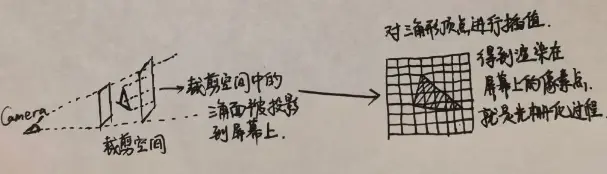

# Shader 第二篇 · 实现URP Unlit Shader

> 年少爱喝苹果醋 · 编辑于 2026年01月02日

## 1. 搭建URP Shader基础代码结构

在编写URP Shader时，首先应该编写一个基础的URP Shader代码结构，然后基于此基础结构进行内容填充，具体代码如下：

```hlsl
Shader "IGame/Diffuse"
{
    // --------1.编写Properties代码块, 当前Shader所需属性都在此定义  
    Properties
    {
        _BaseMap("Base Map", 2d) = "white" {}
        _BaseColor("Base Color", Color) = (1, 1, 1, 1)
         
        ……
    }
  
    // --------2.编写SubShader代码块, 当前Shader的Tags、Pass块都在该SubShader内实现   
    SubShader
    {
        // --------3.编写Tags块, 用于定义当前SubShader的渲染管线、渲染队列等
        Tags
        {
            "RenderPipeline" = "UniversalPipeline"
            "RenderType" = "Opaque"
            "Queue" = "Geometry"
        }
      
        // --------4.编写HLSLINCLUDE块, 用于引入Unity URP核心文件和定义CBUFFER
        HLSLINCLUDE
            #include "Packages/com.unity.render-pipelines.universal/ShaderLibrary/Core.hlsl"

            CBUFFER_START(UnityPerMaterial)
                float4 _BaseMap_ST;
                float4 _BaseColor;

                ……
            CBUFFER_END
        ENDHLSL
                  
        // --------5.编写第一个Pass块
        Pass
        {
            Name "ForwardLit"
              
            Tags
            {
                "LightMode" = "UniversalForward"    
            }
                  
            // --------6.编写HLSLPROGRAM块, 引入所需URP文件, 指定顶点/片元着色函数
            HLSLPROGRAM
                #include "Packages/com.unity.render-pipelines.universal/ShaderLibrary/Lighting.hlsl"
              
                #pragma vertex ForwardLitPassVertex
                #pragma fragment ForwardLitPassFragment
              
                TEXTURE2D(_BaseMap);
                SAMPLER(sampler_BaseMap);
                  
                // --------7.Attributes定义顶点相关属性
                struct Attributes
                {
                    float3 positionOS   : POSITION;
                  
                    ……
                };
                
                // --------8.Varyings定义光栅化后传递给片元着色器的数据
                struct Varyings
                {
                    float4 positionCS   : SV_POSITION;
                  
                    ……
                };

                // --------9.实现顶点着色函数
                Varyings ForwardLitPassVertex(Attributes input)
                {
                    Varyings output = (Varyings)0;
                  
                    ……
                    return output;
                }

                // --------10.实现片元着色函数
                half4 ForwardLitPassFragment(Varyings input) : SV_Target
                {

                    ……

                }                  
            ENDHLSL   
        }

        // --------11.实现其他Pass块
        Pass
        {
            ……
        }              
    }

    // --------12.当前Shader渲染出错时指定一个回退路径
    FallBack "Hidden/Universal Render Pipeline/FallbackError"
}
```

## 2. 确定Unlit Shader使用的属性以及Pass块

### （1）确定材质需要使用的属性

对于一个不受光照的物体，理论上来说我们只需要使用纹理贴图`_BaseMap`、纹理颜色`_BaseColor`两个基础属性就可以计算出物体最终渲染的颜色了。

除此之外，有些物体的局部区域具有透明效果，我们可以使用AlphaTest实现简单的透明剔除，然后设置一个透明剔除的阈值，alpha低于此阈值的片元都会被视为透明区域剔除掉。需要注意的是，有些物体不需要透明效果，因此需要定义一个AlphaTest的开关，用户勾选时生成使用透明剔除效果的Shader变体，不勾选时即生成不使用透明剔除的Shader变体。

物体在渲染时通常可以选择"双面渲染"、"只渲染朝向相机的面（背面剔除）"，这就是面剔除效果，为了实现该效果，我们需要定义属性`_Cull`，允许用户根据物体实际情况选择不剔除/前面剔除/背面剔除效果。

定义好的属性如下：

```hlsl
Properties
{
    _BaseMap("Base Map", 2d) = "white" {}
    _BaseColor("Base Color", Color) = (1, 1, 1, 1)

    [Toggle(_ALPHATEST_ON)] _AlphaTestToggle("Alpha Clipping", Float) = 0
    _Cutoff("Alpha Cutoff", Float) = 0.5

    [Enum(Off, 0, Front, 1, Back, 2)]_Cull("Cull Mode", Float) = 2.0
}
```

### （2）确定需要编写的Pass块

除过需要实现Unlit光照模型的基础Pass之外，Unlit Shader还需要阴影投射ShadowCaster、深度DepthOnly两个Pass，原因如下：

1. 不受光照的物体有可能也需要投射阴影，所以需要ShadowCaster Pass。
2. DepthOnly Pass主要是在深度图中生成当前物体的深度数据。

注意：如果一个物体不需要投射阴影，可以在该物体的【Mesh Renderer】组件上关闭【Cast Shadows】选项。

```hlsl
Pass
{
    Name "Unlit"

    ……
}

Pass
{
    Name "ShadowCaster"

    ……      
}

Pass
{
    Name "DepthOnly"

    ……      
}
```

## 3. 确定Unlit光照计算模型

对于一个不受光的物体，其光照计算模型为：

```
物体最终渲染颜色 = 纹理采样色值 * 材质颜色
```

根据光照模型，我们大致可以知道，顶点着色函数中只需实现顶点属性的MVP转换过程即可，而片元着色函数中，对于光栅化之后的每个三角面插值像素，在进行纹理采样之后，乘上材质颜色就是片元的最终颜色。

由于我们的Unlit Shader需要支持透明剔除效果，因此在片元函数中，对于色值透明度低于阈值的像素，需要进行裁剪。

以下是顶点、片元着色函数实现：

```hlsl
Varyings UnlitPassVertex(Attributes input)
{
    Varyings output = (Varyings)0;
    VertexPositionInputs positionInputs = GetVertexPositionInputs(input.positionOS.xyz);

    output.positionCS = positionInputs.positionCS;
    output.uv = TRANSFORM_TEX(input.uv, _BaseMap);
    output.color = input.color;

    return output;
}

half4 UnlitPassFragment(Varyings input) : SV_Target
{
    half4 baseMap = SAMPLE_TEXTURE2D(_BaseMap, sampler_BaseMap, input.uv);

    #ifdef _ALPHATEST_ON
        clip(baseMap.a - _Cutoff);
    #endif

    return baseMap * _BaseColor;
}
```

关于光栅化过程和片元着色器：

> 摄像机裁剪空间中的网格三角面被投影到屏幕上，经过插值得到屏幕上的像素点，这一过程就是光栅化，光栅化之后屏幕上的三角面插值像素点会作为输入数据传入片元着色器中。

以下是光栅化过程示意图：



根据顶点、片元着色函数的实现，完成Unlit Shader的全部代码：

```hlsl
Shader "IGame/Unlit"
{
    Properties
    {
        // _BaseMap是变量名，"Base Map"是Unity Inspector面板中显示的名称，2d表示该属性是2d纹理，"white"是Unity内置的默认纹理，"white"后的{ }用于添加其他的纹理属性设置。
        _BaseMap("Base Map", 2d) = "white" {}
        _BaseColor("Base Color", Color) = (1, 1, 1, 1)

        // [Toggle(_ALPHATEST_ON)]表示启用_ALPHATEST_ON宏开关，用户在Unity Inspector面板开启或关闭该宏时，都会生成相应的Shader变体。
        [Toggle(_ALPHATEST_ON)] _AlphaTestToggle("Alpha Clipping", Float) = 0
        _Cutoff("Alpha Cutoff", Float) = 0.5
        
        // _Cull表示当前枚举属性用于选择面剔除模式，可以选择"不剔除"/"前面剔除"/"背面剔除"
        [Enum(Off, 0, Front, 1, Back, 2)]_Cull("Cull Mode", Float) = 2.0
    }

    SubShader
    {
        // 公用Tags：渲染管线为URP、渲染类型为不透明、渲染队列为透明
        Tags
        {
            "RenderPipeline" = "UniversalPipeline"
            "RenderType" = "Opaque"
            "Queue" = "Geometry"
        }

        // HLSL包含文件声明。注意：Unity URP Shader代码本质是Unity Shader中嵌入HLSL代码块，渲染时这些HLSL代码会在底层图形库中执行。
        HLSLINCLUDE
            #include "Packages/com.unity.render-pipelines.universal/ShaderLibrary/Core.hlsl"

            // CBUFFER用于定义材质的属性常量缓冲区，后缀_ST表示是Scale and Translation，也就是纹理平铺率和offset偏移值
            CBUFFER_START(UnityPerMaterial)
                float4 _BaseMap_ST;
                float4 _BaseColor;
                float _Cutoff;

            CBUFFER_END
        ENDHLSL

        Pass
        {
            // 当前Pass块名为"Unlit"
            Name "Unlit"

            // 当前面剔除模式为_Cull，也就是不剔除/前面剔除/背面剔除中的一种
            Cull [_Cull]

            // 此处开始嵌入HLSL代码，HLSL代码块最终被提交到底层图形库执行
            HLSLPROGRAM

            // 指定顶点着色函数、片元着色函数
            #pragma vertex UnlitPassVertex
            #pragma fragment UnlitPassFragment
              
            // 根据用户是否开启/关闭AlphaTest宏来生成相应的Shader变体
            #pragma shader_feature _ALPHATEST_ON

            // 在URP中跨平台声明纹理对象、纹理对象采样器
            TEXTURE2D(_BaseMap); 
            SAMPLER(sampler_BaseMap);

            // Attributes结构体中定义顶点相关的数据，这些数据在渲染时由系统赋值。其中positionOS表示对象空间（模型空间）下的顶点坐标，color表示顶点颜色。
            struct Attributes
            {
                float4 positionOS   : POSITION;
                float2 uv           : TEXCOORD0;
                float4 color        : COLOR;
            };

            // Varyings结构体定义了从顶点着色器输出，经过光栅化后在投影到屏幕的三角面中插值像素点，然后传递给片元着色器的数据。这些数据用于计算最终渲染到屏幕的像素颜色。
            struct Varyings
            {
                float4 positionCS   : SV_POSITION;
                float2 uv           : TEXCOORD0;
                float4 color        : COLOR;
            };

            // 顶点着色函数，通常命名为"xxxPassVertex"，xxx为Pass名称。
            Varyings UnlitPassVertex(Attributes input)
            {
                Varyings output = (Varyings)0;
              
                // GetVertexPositionInputs函数主要实现MVP过程，也就是将顶点坐标从模型空间转换到视图空间，再转换到投影空间（也就是裁剪空间，然后赋值给positionCS）。
                VertexPositionInputs positionInputs = GetVertexPositionInputs(input.positionOS.xyz);

                output.positionCS = positionInputs.positionCS;
                output.uv = TRANSFORM_TEX(input.uv, _BaseMap);
                output.color = input.color;

                return output;
            }

            // 片元着色函数，根据光栅化过程可以知道片元着色器操作的对象是三角面投影在屏幕上的每个像素点，返回该像素的最终颜色值。
            half4 UnlitPassFragment(Varyings input) : SV_Target
            {
                // 对于不受光的物体来说，其片元着色过程只需要从纹理贴图上采样，然后进行透明剔除，再乘上材质颜色值即可。
                half4 baseMap = SAMPLE_TEXTURE2D(_BaseMap, sampler_BaseMap, input.uv);

                #ifdef _ALPHATEST_ON
                    clip(baseMap.a - _Cutoff);
                #endif

                return baseMap * _BaseColor;
            }

            ENDHLSL
        }

        Pass
        {
            // 阴影投射Pass块直接使用URP内置的ShadowCasterPass文件即可。
            Name "ShadowCaster"

            Tags
            {
                "LightMode" = "ShadowCaster"
            }

            ZWrite On
            ZTest LEqual

            ColorMask 0
            Cull [_Cull]

            HLSLPROGRAM

            #pragma shader_feature _ALPHATEST_ON
            #pragma shader_feature _SMOOTHNESS_TEXTURE_ALBEDO_CHANNEL_A

            #pragma multi_compile_instancing

            #pragma multi_compile_vertex _CASTING_PUNCTUAL_LIGHT_SHADOW

            #pragma vertex ShadowPassVertex
            #pragma fragment ShadowPassFragment

            #include "Packages/com.unity.render-pipelines.core/ShaderLibrary/CommonMaterial.hlsl"
            #include "Packages/com.unity.render-pipelines.universal/ShaderLibrary/SurfaceInput.hlsl"
            #include "Packages/com.unity.render-pipelines.universal/Shaders/ShadowCasterPass.hlsl"

            ENDHLSL
        }

        Pass
        {
            // DepthOnly Pass块直接使用URP内置的DepthOnlyPass即可。
            Name "DepthOnly"

            Tags
            {
                "LightMode" = "DepthOnly"
            }

            ZWrite On
            ZTest LEqual

            ColorMask 0

            HLSLPROGRAM

            #pragma vertex DepthOnlyVertex
            #pragma fragment DepthOnlyFragment

            #pragma shader_feature _ALPHATEST_ON
            #pragma shader_feature _SMOOTHNESS_TEXTURE_ALBEDO_CHANNEL_A

            #pragma multi_compile_instancing

            #include "Packages/com.unity.render-pipelines.core/ShaderLibrary/CommonMaterial.hlsl"
            #include "Packages/com.unity.render-pipelines.universal/ShaderLibrary/SurfaceInput.hlsl"
            #include "Packages/com.unity.render-pipelines.universal/Shaders/DepthOnlyPass.hlsl"

            ENDHLSL            
        }
    }

    FallBack "Hidden/Universal Render Pipeline/FallbackError"
}
```
